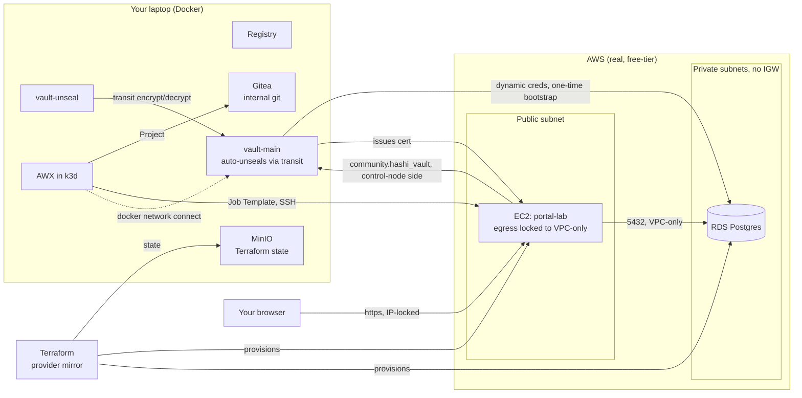

# Architecture

This lab reproduces the operational pattern of an air-gapped Terraform +
Vault + Ansible deployment, substituting free/local tooling for anything
that would otherwise need an enterprise license, and running real
infrastructure so the app at the end is genuinely reachable, not simulated.

## Why each piece exists

| Component | Real-world equivalent | What it demonstrates |
|---|---|---|
| Provider mirror (`terraform providers mirror`) | An internal Terraform provider registry inside an air-gapped enclave | Never depending on `registry.terraform.io` at apply time |
| `vault-unseal` + `vault-main` (Transit auto-unseal) | A dual-cluster Vault deployment with no cloud KMS or HSM available | Auto-unseal that works with zero external dependencies |
| Vault `database` secrets engine | Dynamic, short-lived database credentials issued on demand | Nothing long-lived to leak — every credential has a 1-hour TTL |
| Vault `pki` secrets engine | An internal CA issuing certs to every host | Centralized trust instead of self-signed certs everywhere |
| Public subnet + VPC-only egress security group | An inbound-only DMZ pattern | The instance is reachable, but network-enforced to have zero path to the public internet — not "we chose not to install things," but "it structurally cannot" |
| RDS in private subnets, no IGW | A real database with no public exposure | Standard least-exposure DB placement, and solves the real problem of the app needing to reach a database from AWS, not from your laptop |
| The portal app itself (`portal_app.py`) | Vendored, dependency-free deployment | Runs with zero `pip install` on the target — every dependency it needs was staged and copied in by Ansible, not fetched live |
| AWX (k3d) | HashiCorp/Red Hat's Ansible Automation Platform Controller | Projects, Credentials, and Job Templates — the same primitives AAP uses |
| GitHub Actions (`validate.yml`) | A CI gate before any change reaches a shared environment | `terraform validate` + `ansible-lint` on every push |

## Two things worth understanding precisely

**Where `community.hashi_vault` tasks actually execute.** The `vault_read` /
`vault_write` tasks in `ansible/roles/portal/tasks/main.yml` run via action
plugins on the **control node** (wherever `ansible-playbook`/AWX's execution
environment runs), not on the EC2 instance. That's *why* the EC2 instance
never needs direct network access to Vault — only your laptop (or AWX's EE
pod, connected to `enclave-net`) does. The instance only ever receives the
already-fetched secrets, copied in as files.

**Why egress is locked to the VPC CIDR, not "no route at all."** RDS lives
in private subnets with genuinely no route to the internet. The EC2 instance
technically sits in a subnet *with* an IGW route (so your browser/SSH can
reach it), but its security group's egress rule only permits VPC-internal
traffic — so even though a route exists, the instance can never use it to
reach anything outside the VPC. That's what makes "no live package
installs" a network-enforced fact here, not a convention someone could
accidentally violate.

## Known limitation

AWX's pods run inside k3d's own cluster network, separate from the
`enclave-net` Docker network everything else is on. `scripts/04-awx-up.sh`
resolves this with `docker network connect` plus addressing services by
container IP rather than name — the one place in this lab where the fix
depends on your local Docker setup rather than being a single universal
command.
